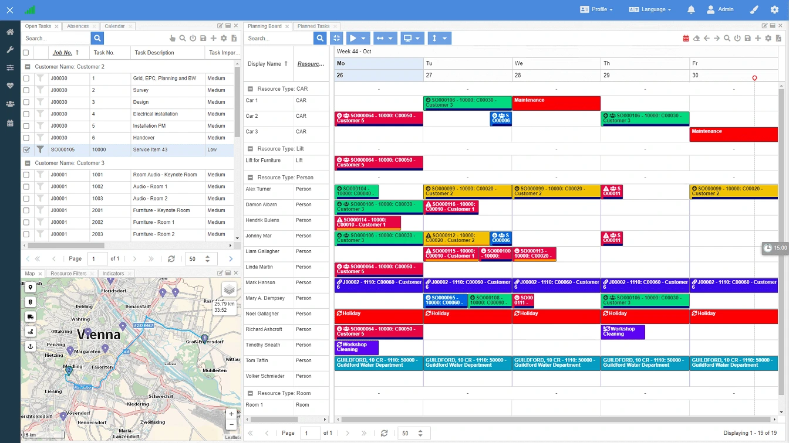

  <a href="https://docs.dimescheduler.com">Documentation</a> |
  <a href="https://docs.dimescheduler.com/history">Changelog</a> |
  <a href="https://docs.dimescheduler.com/roadmap">Roadmap</a>

  
  
  

<h1 align="center"> Dime.Scheduler</h1>

Supercharge your business by powering up Microsoft Dynamics 365 Business Central with a centralized resource and project planning solution 📅. Dime.Scheduler, with its powerful features and flexible design, has a proven track record in various industries and is trusted by dozens of resellers and thousands of people all over the world 🚀.

## Installation

## Quick Start

## Examples

## Contributing

Pull requests are welcome. Please check out the contribution and code of conduct guidelines.

## License

Copyright © Dime CVBA - All rights reserved.

Unauthorized copying of this file, via any medium is strictly prohibited Proprietary and confidential.

Written by Hendrik Bulens hendrik@dime-software.com, March 2022.

