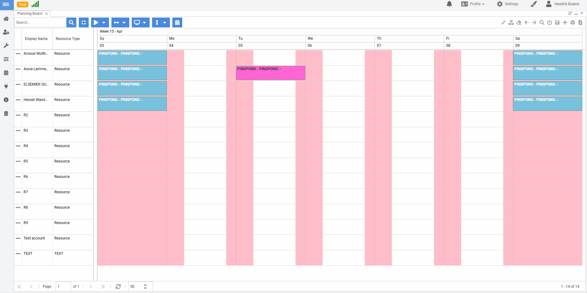

# Dime.Scheduler SDK for JavaScript sample: Ping Pong

## Getting started

Install the dependencies

```cmd
bun install
```

Create an `.env` file with the Mapbox and Dime.Scheduler API keys:

```
DS_API_KEY=
```

There are two commands that you can run: `stage` and `play`.

The `stage` command is create the playing field. It requires three sets of information: the start date (parameter 's'), the end date (parameter 'e'), and a list of resources to create appointments for:

```
bun stage -s '2022-04-03' -e '2022-04-09' -r 'ARNOUD' -r 'ASSIA' -r 'ELSEMIEK' -r 'HESSEL'
``` 

The `play` command accepts the same parameters:

```
bun play -s '2022-04-03' -e '2022-04-09' -r 'ARNOUD' -r 'ASSIA' -r 'ELSEMIEK' -r 'HESSEL'
``` 

## Application in action



