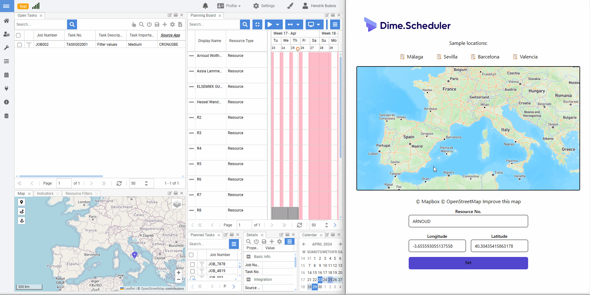

# Dime.Scheduler SDK for JavaScript sample: Update location

## Getting started

To run the project, run the following commands:

```cmd
bun install
bun dev
```

Create an `.env` file with the Mapbox and Dime.Scheduler API keys:

```
VITE_MAPBOX_KEY=
VITE_DS_API_KEY=
```


The terminal will prompt the URI where you can access the web app.

## About

Most of the interesting code is in the `App.tsx` file. In the `updateLocation` method, the SDK is invoked.

```javascript
const updateLocation = async (resourceNo: string, latitude: number, longitude: number) => {
  const location = new Models.ResourceGpsTracking();
  location.resourceNo = resourceNo;
  location.latitude = latitude;
  location.longitude = longitude;

  const client = new DimeSchedulerClient(apiKey);
  await client.import(location);
  }
```

## Application in action

